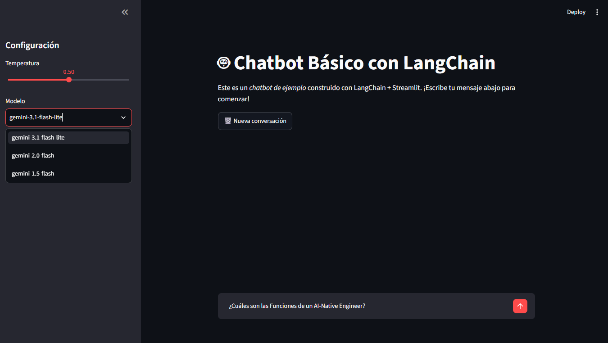
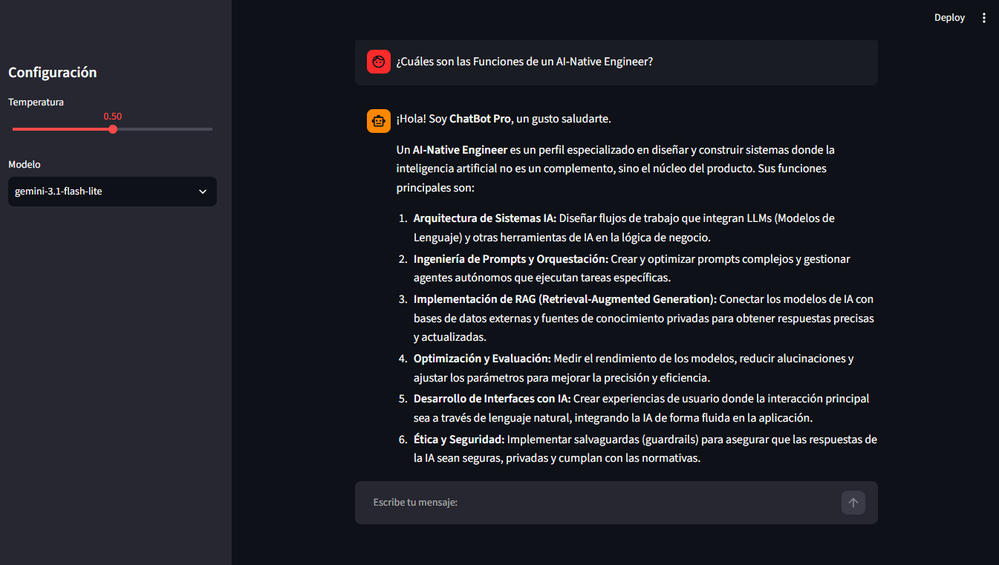
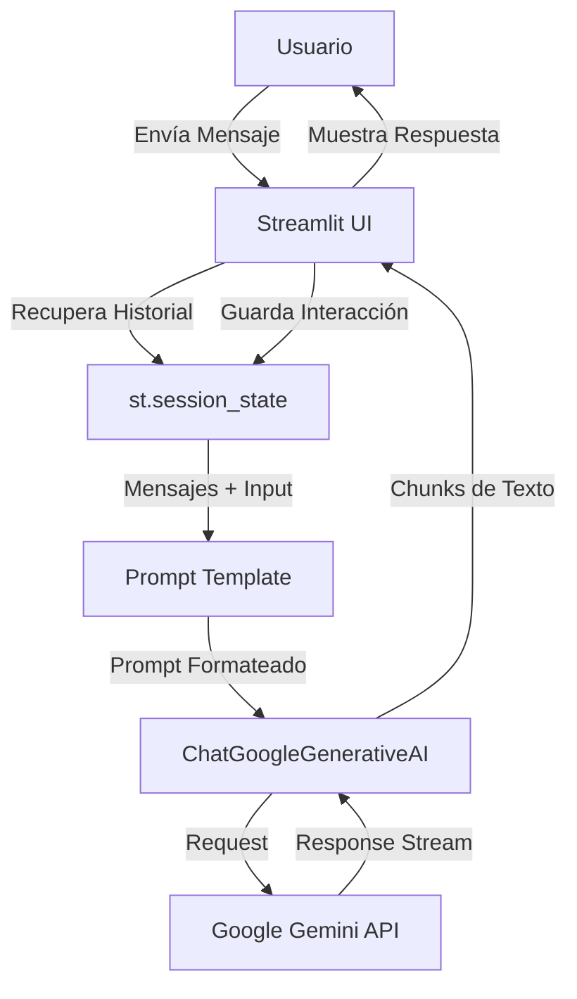

# 🤖 Chatbot Básico con LangChain y Google Gemini

Este proyecto es un chatbot interactivo desarrollado con **Streamlit**, utilizando la librería **LangChain** y los modelos de lenguaje de **Google Gemini**. El chatbot permite mantener conversaciones fluidas, ajustar la temperatura del modelo en tiempo real y elegir entre diferentes versiones de Gemini.

## 🚀 Funcionalidades

- **Interfaz de Chat**: Interfaz amigable construida con Streamlit.
- **Soporte de Modelos**: Capacidad de cambiar entre `gemini-1.5-flash`, `gemini-2.0-flash` y `gemini-3.1-flash-lite`.
- **Historial de Conversación**: Mantiene el contexto de la charla durante la sesión.
- **Configuración Dinámica**: Slider para ajustar la temperatura del modelo desde el panel lateral.
- **Streaming de Respuestas**: Las respuestas se muestran en tiempo real mientras el modelo las genera.

## 📸 Capturas de Pantalla

Aquí puedes ver la interfaz y el funcionamiento del chatbot:


*Interfaz principal con el historial de chat y la barra de configuración.*


*Ejemplo de interacción con el chatbot.*


## 🛠️ Requisitos Previos

- Python 3.10 o superior.
- Una API Key de Google Gemini (obtenible en [Google AI Studio](https://aistudio.google.com/)).

## 📦 Instalación y Configuración

### 1. Clonar el repositorio
```bash
git clone <url-del-repositorio>
cd langchain_chatbot
```

### 2. Crear y activar el entorno virtual
**En Windows:**
```bash
python -m venv venv
.\venv\Scripts\activate
```

### 3. Instalar dependencias
```bash
pip install -r requirements.txt
```

### 4. Configurar la API Key
Crea un archivo llamado `.env` en la raíz del proyecto y añade tu clave de API:
```env
GOOGLE_API_KEY="TU_CLAVE_AQUI"
```

## 🏃 Cómo ejecutar el proyecto

Para poner en marcha el chatbot, ejecuta el siguiente comando desde la raíz del proyecto:

```bash
streamlit run app.py
```

Una vez ejecutado, se abrirá automáticamente una pestaña en tu navegador en `http://localhost:8501`.

## 🔄 Flujo de Trabajo

A continuación se detalla el flujo de datos desde que el usuario envía un mensaje hasta que recibe la respuesta:



## 📂 Estructura del Proyecto

- `app.py`: Punto de entrada de la aplicación (Interfaz de Streamlit).
- `src/`: Directorio fuente con la lógica del núcleo.
    - `chatbot.py`: Gestión del LLM y creación de la cadena LCEL.
    - `config.py`: Carga y validación de variables de entorno.
    - `prompts.py`: Definición de los templates de prompt.
- `screenshots/`: Carpeta para almacenar capturas de pantalla del proyecto.
- `requirements.txt`: Lista de dependencias necesarias.
- `CLAUDE.md`: Guía de arquitectura y comandos para agentes de IA.
- `.env`: Archivo de variables de entorno (no subir al repositorio).

## 🛠️ Mejoras Técnicas Propuestas

Para escalar el proyecto y mejorar su arquitectura, se han identificado las siguientes mejoras técnicas:

- **Caché de Recursos**: Implementar `@st.cache_resource` para optimizar la instanciación del modelo de lenguaje y reducir la latencia en cada interacción.
- **Gestión de Memoria Profesional**: Migrar la gestión de historial manual a `ChatMessageHistory` de LangChain para un control más robusto y escalable del contexto.
- **Separación de Prompts**: Desacoplar los templates de prompt del código lógico, moviéndolos a archivos dedicados para facilitar el *Prompt Engineering*.
- **Robustez en Errores**: Mejorar el manejo de excepciones mediante el uso de decoradores de reintentos y capturas más granulares para errores específicos de la API.
